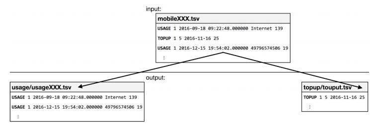

# Splitting Streams

## Preconditions:
1.	Scala Programming
2.	Structured Programming to be implemented
3.	Usage of sbt to package code
4.	Executable to run with spark-submit

## Conditions:
1.	Directory path taken as arguments ($ spark-submit application.jar inputdir outputdir )
2.	Application listens to inputdir for new files
3.	Application creates output files based on certain parameters as given in below image

4.	Using structured streams to observe new changes to input directory and run the filtering againq
5.	Should run until user stops the Application

## Post Condition:
1.	No duplicates or missing contents after closing the Application
2.	If Application is run again, the existing output directory is overwritten

## Evaluation Criteria:
1.	programming style
	1.	code structure & style
	2.	handling exceptions (ie. parameter validation, input data validation, runtime errors)
2.	completeness of the solution:
	1.	Spark framework familiarity
	2.	Streaming utilization
	3.	correctness of the output
	4.	(optional/bonus) conversion to other Spark supported format as output (ie. json, parquet etc...)

## Solution
 - [x] Used Structured Streaming to dynamically observe and create output files (Using streams and dataframes
 - [x] Using multithreading to implement Renaming of files. There exists no implementation to rename files. Another approach could have been hacking into library file to make required changes. Problem with this is upgrading to newer libraries would mean additional work of migrating code.
 - [ ] Additional formats could be implemented in other spark supported formats